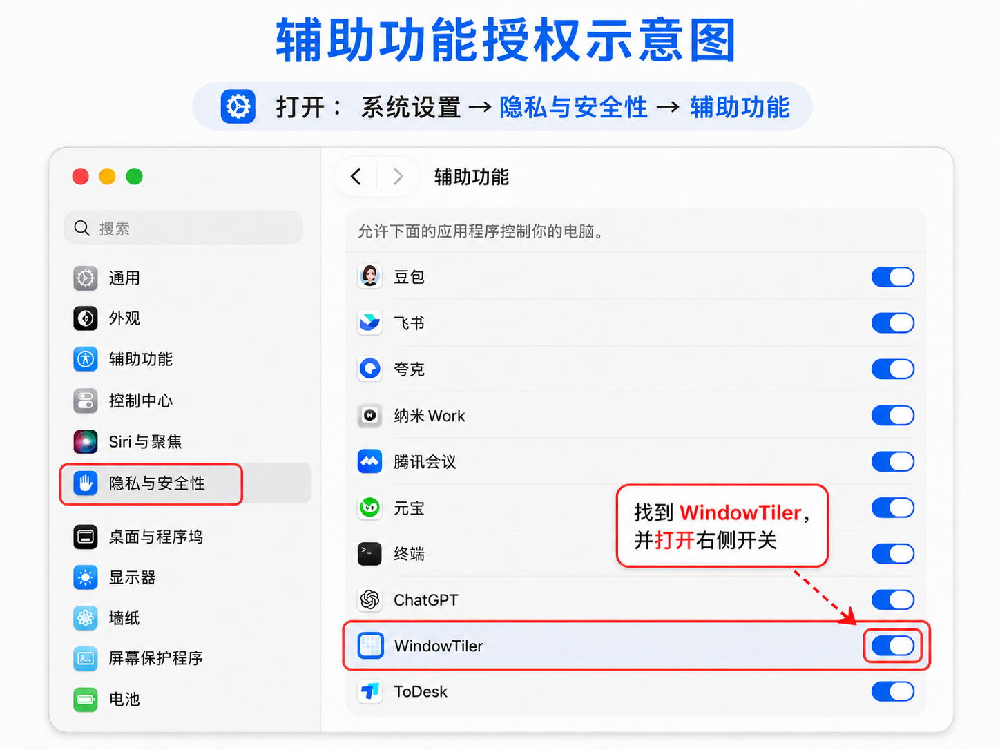

# WindowTiler

> 一键整理 Mac 窗口的菜单栏工具，支持多列宫格布局。


## 功能

- **菜单栏常驻**，不占 Dock 位置
- 一键将当前屏幕所有可见窗口自动排列
- 支持 6 种布局：
  - 2 列 / 3 列 / 4 列
  - 2×2 / 3×2 / 4×2 宫格

## 安装

### 方式一：直接下载（推荐）

从 [Releases](../../releases) 页面下载最新 `WindowTiler.app.zip`，解压后拖到 `/Applications` 即可。

### 方式二：自行编译

```bash
git clone https://github.com/yourname/WindowTiler.git
cd WindowTiler
bash build_app.sh
cp -r WindowTiler.app /Applications/
```

需要 Xcode Command Line Tools：`xcode-select --install`

## 使用方法

1. 打开 `WindowTiler.app`
2. **首次运行**：系统会提示授权辅助功能权限
   - 前往：**系统设置 → 隐私与安全性 → 辅助功能**
   - 找到 WindowTiler，点击开关启用
3. 菜单栏出现 `⊞` 图标，点击选择布局即可

## 授权辅助功能

> macOS 要求所有控制其他窗口的 App 必须获得辅助功能授权，这是系统级安全限制。



## 技术实现

- **语言**：Swift 5.9
- **框架**：AppKit + Accessibility API（`AXUIElement`）
- **架构**：单文件 SPM executable，无第三方依赖
- **核心逻辑**：遍历运行中 App 的 AX 窗口树 → 过滤当前屏幕 + 未最小化的窗口 → 按宫格坐标批量设置 `kAXPositionAttribute` 和 `kAXSizeAttribute`

## 路线图

- [ ] 快捷键触发布局
- [ ] 记忆上次使用的布局
- [ ] 多显示器支持
- [ ] 忽略特定 App（白名单/黑名单）
- [ ] 自定义行列数输入
- [ ] 窗口间距设置

## 贡献

PR 和 Issue 欢迎！详见 [CONTRIBUTING.md](CONTRIBUTING.md)

## 许可证

MIT License — 随意使用、修改和分发。
